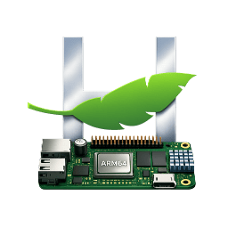

# Haiku ARM64 Build Environment



Reproducible build setup for Haiku OS ARM64 on Orange Pi 6 Plus.

## Status: User session survives SetupEnvironment with consistent ICU74 (2026-04-22)

The kernel loads, BFS mounts, `launch_daemon` starts, and user session environment
processing now completes without crashing when the package set contains a single
consistent ICU version (ICU74).

Confirmed causes of prior boot failures, in resolution order:

1. SCSI CCB panic on USB storage emulation → fixed (`a0ee6cf196`)
2. packagefs zstd decompression → worked around with uncompressed repacks
3. `libroot.so` TLSDESC relocation → partially fixed (`daa993f414`, binary unverified)
4. `launch_daemon` env tail parsing → fixed (`5059bc3bc8`)
5. `Thread 51` / `consoled -4` crash on `SetupEnvironment` → **ICU version collision**
   (icu-67.1 + ICU74 coexistence); resolved by using ICU74-only package set

Detailed experiment matrix: [`docs/boot-debug-notes-2026-04-22.md`](docs/boot-debug-notes-2026-04-22.md)

## Quick Start

```sh
make deps        # install prerequisites (once)
make clone       # clone haiku + buildtools repos
make toolchain   # build cross-compiler (~15 min)
make image       # build minimum MMC image (~5 min)
make test        # QEMU smoke test (30s)
```

## QEMU Boot (working)

```sh
qemu-system-aarch64 \
  -bios /usr/share/qemu-efi-aarch64/QEMU_EFI.fd \
  -M virt -cpu max -m 2048 \
  -device virtio-scsi-pci \
  -device scsi-hd,drive=x0 \
  -drive file=haiku-mmc.image,if=none,format=raw,id=x0 \
  -device virtio-keyboard-device \
  -device virtio-tablet-device \
  -device ramfb -serial stdio
```

**Note:** Must use `virtio-scsi-pci`, not `virtio-blk-device`.

## Build Host

- Orange Pi 6 Plus (CIX P1, 12 cores, 14 GiB RAM)
- Debian Trixie (aarch64), kernel 6.6.89-cix
- GCC 14.2.0 (host) / 13.3.0 (cross-compiler)

## Repos

- `haiku/` — Haiku source (from review.haiku-os.org)
- `buildtools/` — Cross-compiler + jam
- `haikuporter/` — Package build tool
- `haikuports/` — smrobtzz arm64-fixes branch
- `haikuports.cross/` — smrobtzz update-everything branch
