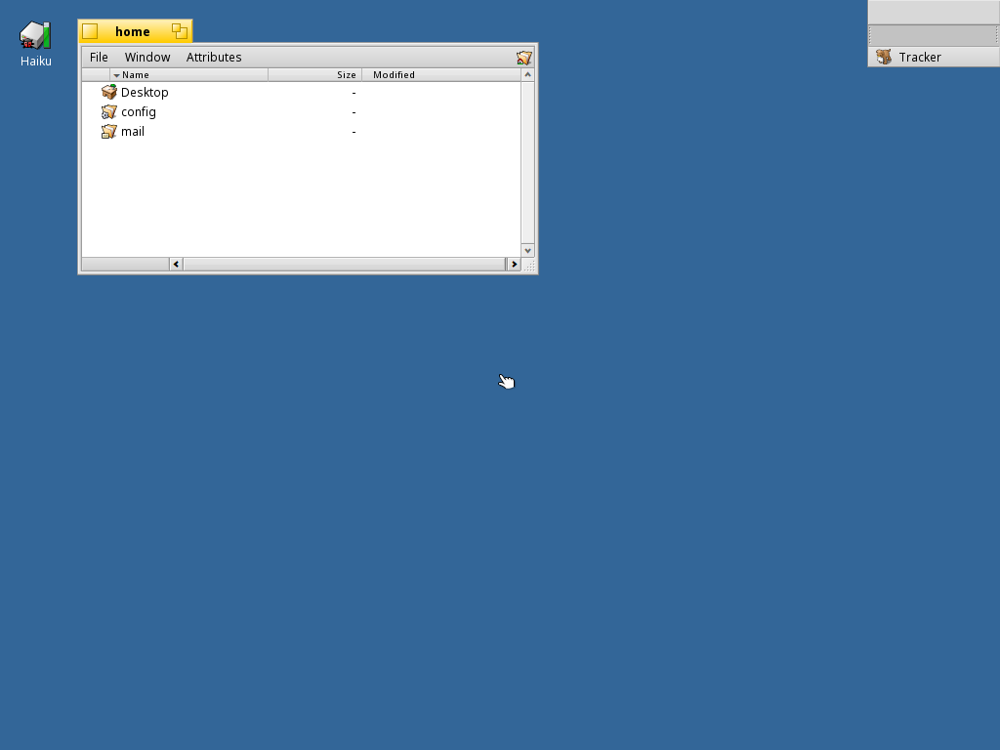

# Haiku ARM64 Build Environment


Reproducible build setup for Haiku OS ARM64 on Orange Pi 6 Plus.

## Status: Boots to Desktop from the Full Direct Package Lane (2026-04-25)

Haiku ARM64 now **boots to a desktop session in QEMU** from the validated
full direct-package lane. The kernel loads, BFS mounts, `launch_daemon` starts,
`package_daemon` reports `/boot/system` consistent, and the desktop user-session
comes up far enough to launch `app_server`, `Tracker`, and `Deskbar`.



_This screenshot shows the current validated boot lane with Tracker visible. The
current image now uses the full direct `haiku.hpkg` package on a grown system
partition and now rides on top of the newer hrev59653-style stock arm64
nightly bootstrap package set. The current overlay is down to `expat_bootstrap`
and `zstd_bootstrap`, while the older `compat_bootstrap_runtime` and repacked
shell-package workarounds are no longer part of the default validated image._

Directly validated in-guest:

- `SetupEnvironment` completes without crashing when the package set is ICU-consistent
  (ICU74 only)
- `app_server` launches
- `Tracker` launches
- `Deskbar` launches
- `package_daemon` reports `/boot/system` consistent with the current direct-package test image

Confirmed causes of prior boot failures, in resolution order:

1. SCSI CCB panic on USB storage emulation → fixed (`a0ee6cf196`)
2. packagefs zstd decompression → worked around with uncompressed repacks
3. `libroot.so` TLSDESC relocation → partially fixed (`daa993f414`, binary unverified)
4. `launch_daemon` env tail parsing → fixed (`5059bc3bc8`)
5. `Thread 51` / `consoled -4` crash on `SetupEnvironment` → **ICU version collision**
   (icu-67.1 + ICU74 coexistence); resolved by using an ICU74-consistent package set

Detailed experiment matrix: [`docs/boot-debug-notes-2026-04-23.md`](docs/boot-debug-notes-2026-04-23.md)

## Quick Start

```sh
make deps        # install prerequisites (once)
make clone       # clone haiku + buildtools repos
make toolchain   # build cross-compiler (~15 min)
make image       # build minimum MMC image (~5 min)
make test        # QEMU smoke test (30s)
make desktop-image  # assemble the validated ICU74 desktop test image
```

## Early Validation Harness

For later regression work, the repo now includes a small QEMU desktop harness:

```sh
make desktop-image       # assemble the validated ICU74 desktop boot image
make desktop-run         # start that image under detached tmux
make desktop-status      # print session/log/state info and recent serial output
make desktop-logs        # tail the serial log interactively
make desktop-attach      # attach to the tmux session
make desktop-screenshot  # save a framebuffer screenshot from the detached run
make desktop-stop        # stop the detached tmux session
make desktop-validate    # headless validation using injected marker jobs
```

The harness script is:

- `scripts/qemu-desktop-harness.sh`

Current defaults:

- base nightly image: `/workspace/tmp/haiku-nightly-arm64/haiku-master-hrev59653-arm64-mmc.image`
- built desktop image: `/workspace/tmp/haiku-build/validated/haiku-arm64-icu74-desktop.boot.img`
- direct package: `/workspace/tmp/haiku-build/validated/haiku-direct-icu74.hpkg`
- compat package artifact (legacy fallback only): `/workspace/tmp/haiku-build/validated/compat_bootstrap_runtime-1-2-arm64.hpkg`
- graphical run image: same as above
- validation image: same as above

`make desktop-image` now assembles the reproducible local ICU74 desktop image from:

- the generated direct `haiku.hpkg` contents
- a grown system partition (currently 512 MiB)
- the stock hrev59653 arm64 nightly bootstrap package set from the base image
- `expat_bootstrap-2.5.0-1-arm64.hpkg`
- `zstd_bootstrap-1.5.6-1-arm64.hpkg`

For older base images, the script still has a legacy fallback path that injects
`compat_bootstrap_runtime` plus sanitized bootstrap `bash`/`coreutils` packages.

`make desktop-run` is the primary async path. It returns immediately and writes a
stable tmux/state/monitor setup under:

- `/workspace/tmp/haiku-boot-harness/`

For interactive follow-up after `make desktop-run`:

- `make desktop-status`
- `make desktop-logs`
- `make desktop-attach`
- `make desktop-screenshot`

`make desktop-capture` still exists as a blocking convenience target, but it is not
required for the normal async workflow.

The validation mode boots headlessly, injects additive temporary `user_launch` jobs into a
writable copy of the image, captures the serial log, and verifies launch markers for:

- `app_server`
- `Tracker`
- `Deskbar`

## QEMU Boot (working)

```sh
qemu-system-aarch64 \
  -bios /usr/share/qemu-efi-aarch64/QEMU_EFI.fd \
  -M virt -cpu max -m 2048 \
  -device virtio-scsi-pci \
  -device scsi-hd,drive=x0 \
  -drive file=haiku-mmc.image,if=none,format=raw,id=x0 \
  -device virtio-keyboard-device \
  -device virtio-tablet-device \
  -device ramfb -serial stdio
```

**Note:** Must use `virtio-scsi-pci`, not `virtio-blk-device`.

## Build Host

- Orange Pi 6 Plus (CIX P1, 12 cores, 14 GiB RAM)
- Debian Trixie (aarch64), kernel 6.6.89-cix
- GCC 14.2.0 (host) / 13.3.0 (cross-compiler)

## Repos

- `haiku/` — Haiku source (from review.haiku-os.org)
- `buildtools/` — Cross-compiler + jam
- `haikuporter/` — Package build tool
- `haikuports/` — smrobtzz arm64-fixes branch
- `haikuports.cross/` — smrobtzz update-everything branch

## Current Caveats

The direct package lane now validates end-to-end, but it is not fully de-hacked yet.
The remaining deliberate shims in the current default validated lane are:

- `expat_bootstrap-2.5.0-1-arm64.hpkg`
- `zstd_bootstrap-1.5.6-1-arm64.hpkg`

A legacy fallback path is still kept in the builder for older base images, where
it can inject `compat_bootstrap_runtime` plus sanitized bootstrap shell packages.

The `haiku/` branch `arm64-bootstrap-fixes` also now includes a merge of current
`upstream/master`, but still keeps an arm64 `HAIKU_NO_DOWNLOADS=1` fallback to
`HaikuPortsCross` because the newer upstream remote package set is not yet fully
available in this local workspace.
