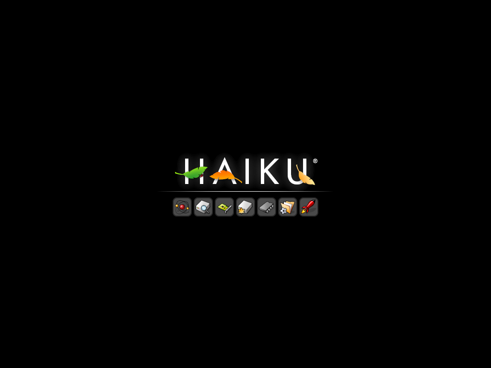

# Haiku ARM64 Build Environment


Reproducible build setup for Haiku OS ARM64 on Orange Pi 6 Plus.

## Status: Nearly Bootable (2026-04-23)

The kernel loads, BFS mounts, `launch_daemon` starts, and the desktop user-session
path now launches in the validated ICU74 lane. The remaining work is mostly around
turning that validated lane into a cleaner, less ad-hoc packaged build and making the
framebuffer/desktop behavior more reliable in unattended harness runs.



_The screenshot above is the latest detached-harness framebuffer capture. It is still
not a strong proof of desktop usability by itself — the stronger signal remains the
in-guest marker validation for `app_server`, `Tracker`, and `Deskbar` launches._

Directly validated in-guest:

- `SetupEnvironment` completes without crashing when the package set is ICU-consistent
  (ICU74 only)
- `app_server` launches
- `Tracker` launches
- `Deskbar` launches
- `package_daemon` reports `/boot/system` consistent with the current ICU74 metadata-fixed test packages

Confirmed causes of prior boot failures, in resolution order:

1. SCSI CCB panic on USB storage emulation → fixed (`a0ee6cf196`)
2. packagefs zstd decompression → worked around with uncompressed repacks
3. `libroot.so` TLSDESC relocation → partially fixed (`daa993f414`, binary unverified)
4. `launch_daemon` env tail parsing → fixed (`5059bc3bc8`)
5. `Thread 51` / `consoled -4` crash on `SetupEnvironment` → **ICU version collision**
   (icu-67.1 + ICU74 coexistence); resolved by using an ICU74-consistent package set

Detailed experiment matrix: [`docs/boot-debug-notes-2026-04-23.md`](docs/boot-debug-notes-2026-04-23.md)

## Quick Start

```sh
make deps        # install prerequisites (once)
make clone       # clone haiku + buildtools repos
make toolchain   # build cross-compiler (~15 min)
make image       # build minimum MMC image (~5 min)
make test        # QEMU smoke test (30s)
make desktop-image  # assemble the validated ICU74 desktop test image
```

## Early Validation Harness

For later regression work, the repo now includes a small QEMU desktop harness:

```sh
make desktop-image       # assemble the validated ICU74 desktop boot image
make desktop-run         # start that image under detached tmux
make desktop-status      # print session/log/state info and recent serial output
make desktop-logs        # tail the serial log interactively
make desktop-attach      # attach to the tmux session
make desktop-screenshot  # save a framebuffer screenshot from the detached run
make desktop-stop        # stop the detached tmux session
make desktop-validate    # headless validation using injected marker jobs
```

The harness script is:

- `scripts/qemu-desktop-harness.sh`

Current defaults:

- built desktop image: `/workspace/tmp/haiku-build/validated/haiku-arm64-icu74-desktop.boot.img`
- graphical run image: same as above
- validation image: same as above

`make desktop-image` assembles the reproducible local ICU74 desktop image from the
nightly base image plus generated runtime/package artifacts.

`make desktop-run` is the primary async path. It returns immediately and writes a
stable tmux/state/monitor setup under:

- `/workspace/tmp/haiku-boot-harness/`

For interactive follow-up after `make desktop-run`:

- `make desktop-status`
- `make desktop-logs`
- `make desktop-attach`
- `make desktop-screenshot`

`make desktop-capture` still exists as a blocking convenience target, but it is not
required for the normal async workflow.

The validation mode boots headlessly, injects a temporary `user_launch` wrapper into a
writable copy of the image, captures the serial log, and verifies launch markers for:

- `app_server`
- `Tracker`
- `Deskbar`

## QEMU Boot (working)

```sh
qemu-system-aarch64 \
  -bios /usr/share/qemu-efi-aarch64/QEMU_EFI.fd \
  -M virt -cpu max -m 2048 \
  -device virtio-scsi-pci \
  -device scsi-hd,drive=x0 \
  -drive file=haiku-mmc.image,if=none,format=raw,id=x0 \
  -device virtio-keyboard-device \
  -device virtio-tablet-device \
  -device ramfb -serial stdio
```

**Note:** Must use `virtio-scsi-pci`, not `virtio-blk-device`.

## Build Host

- Orange Pi 6 Plus (CIX P1, 12 cores, 14 GiB RAM)
- Debian Trixie (aarch64), kernel 6.6.89-cix
- GCC 14.2.0 (host) / 13.3.0 (cross-compiler)

## Repos

- `haiku/` — Haiku source (from review.haiku-os.org)
- `buildtools/` — Cross-compiler + jam
- `haikuporter/` — Package build tool
- `haikuports/` — smrobtzz arm64-fixes branch
- `haikuports.cross/` — smrobtzz update-everything branch
